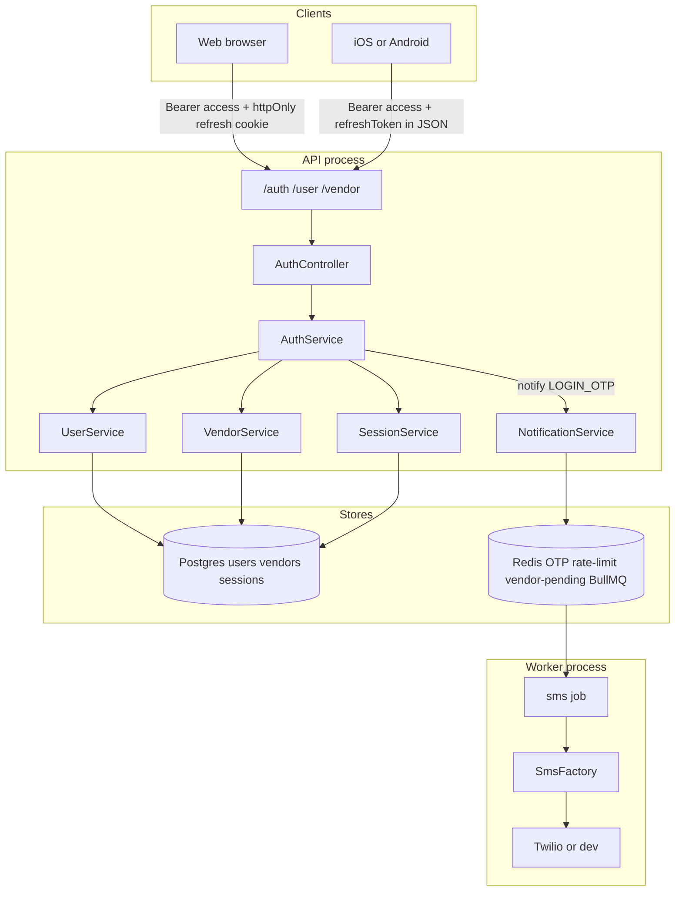
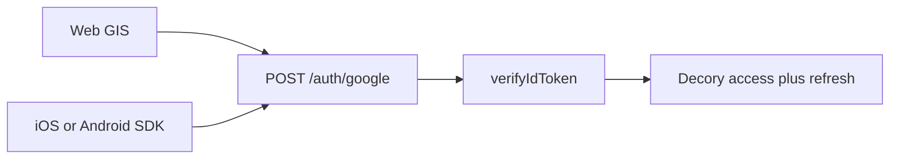

# Identity module

Composition-root auth for Decory: OTP login (users auto-created), vendor register, Google, admin password, JWT access + hashed refresh in Postgres.

There is **no email/password signup for customers**. A user row is created on first successful OTP verify.

## Runtime

You need all four:


| Process  | Command                 | Why                                     |
| -------- | ----------------------- | --------------------------------------- |
| API      | `pnpm dev`              | HTTP                                    |
| Worker   | `pnpm worker:dev`       | Sends SMS from the `sms` queue; reads notification channel flags from Postgres |
| Postgres | `POSTGRES_DATABASE_URL` | Users, vendors, sessions                |
| Redis    | `REDIS_URL`             | OTP, rate limit, vendor pending, BullMQ |


API `200` on OTP request means the job was **enqueued**, not that Twilio delivered.

Default API: `http://localhost:3000` (`PORT` in `.env`). Identity base: `http://localhost:3000/api/v1`.

CORS allows `http://localhost:5173` with credentials. Cookie `secure` is on only when `NODE_ENV=production`. `sameSite` is `lax`.

---


## Response envelopes

Success (`statusCode < 400`):

```json
{
  "success": true,
  "statusCode": 200,
  "data": {},
  "message": "logged in"
}
```

Error:

```json
{
  "success": false,
  "message": "invalid otp",
  "errors": []
}
```

---


## Architecture

Identity is a **module inside the API process**, not a separate service. Dependencies are constructed once in `[src/modules/identity/index.ts](../src/modules/identity/index.ts)` and injected as classes.




### Layers


| Layer           | Files                                               | Role                                                        |
| --------------- | --------------------------------------------------- | ----------------------------------------------------------- |
| HTTP            | `auth.route.ts`, `user.route.ts`, `vendor.route.ts` | Mounted at `/api/v1/auth`, `/api/v1/user`, `/api/v1/vendor` |
| Controller      | `auth.controller.ts`, `vendor.controller.ts`        | Cookies vs JSON via `sendAuth`                              |
| Service         | `auth.service.ts`                                   | OTP, Google, admin, vendor, refresh, logout, `/me`          |
| Users / vendors | `users/*`, `vendors/*`                              | Postgres CRUD                                               |
| Sessions        | `sessions/session.service.ts`                       | JWT access + hashed refresh                                 |
| OTP store       | `auth/otp.store.ts`                                 | Redis hashes, rate limits, vendor pending                   |
| Phone           | `auth/phone.ts`                                     | Normalize to E.164 (`+91…` for 10 digits)                   |
| SMS             | `notifications/sms` + `infrastructure/sms`          | Port/adapter; worker sends                                  |


### Session model (hybrid, already built)

Not Redis session IDs. Access is a **stateless JWT**. Refresh is a **random secret stored hashed in Postgres**.


| Token   | Where                                                                                        | Lifetime   | Contents / storage                                       |
| ------- | -------------------------------------------------------------------------------------------- | ---------- | -------------------------------------------------------- |
| Access  | JSON `accessToken`. Client sends `Authorization: Bearer`                                     | 15 minutes | JWT `{ sub, role }` signed with `JWT_SECRET`             |
| Refresh | httpAlways cookie `refreshToken`; **also** JSON `refreshToken` when `clientType` is `mobile` | 30 days    | 32-byte hex. Only `sha256` hash in `sessions.token_hash` |


Each session row has a `familyId` (uuid). First login mints a new family; **rotate reuses the same family**.

On **refresh**: atomic `UPDATE … WHERE token_hash AND revoked_at IS NULL AND expires_at > now() RETURNING `*. Issue a new row with the same `familyId`. If that update matches 0 rows, look up **any** row with that hash (including already revoked). If found, revoke **all** sessions in that family (reuse = theft) then 401. If not found, 401.

On **logout**: revoke that refresh row. Access JWT still verifies until it expires (~15m) unless we add a denylist later.

`authRequired` verifies the JWT, then `findById` and rejects if the user is missing or `status === blocked`. Blocked accounts cannot keep using a live access token on Bearer routes.

### OTP


| Rule            | Value                                                                                          |
| --------------- | ---------------------------------------------------------------------------------------------- |
| Length          | 6 digits (`100000`–`999999`)                                                                   |
| Stored          | HMAC-SHA256 (`OTP_PEPPER` or `JWT_SECRET`) over `phone` + OTP in Redis key `otp:login:{phone}` |
| Compare         | `timingSafeEqual`                                                                              |
| Consume         | Redis `GETDEL` (one successful verify only)                                                    |
| TTL             | 300 seconds                                                                                    |
| Sends           | 5 per phone per hour (`otp:rl:{phone}`) **and** 5 per IP per hour (`otp:rl:ip:{ip}`)           |
| Verify attempts | 5 then the OTP key is not restored                                                             |
| Vendor pending  | Redis `vendor:pending:{phone}`, **same 300s TTL as OTP**                                       |


`purpose` is `"login"` or `"vendor_register"`. Public `POST /auth/otp/request` is **login only** (no `purpose` field). Only `POST /vendor/register` writes `vendor_register`. If `vendor:pending:{phone}` already exists, a later login OTP request **keeps** `vendor_register` so it cannot create a customer.

SMS is **not** sent in the API process. Auth calls `notificationService.assertCanSend("LOGIN_OTP")` then `notify()`. If SMS is disabled, the API returns **503** `sms notifications disabled`. The worker uses `SmsFactory` (`SMS_PROVIDER=dev|twilio`) after the outbox relay.

OTP is returned in JSON **only** when `NODE_ENV === "development"`. Production never echoes OTP, even if `SMS_PROVIDER=dev`.

### Phone normalize

India mobile only. All-zero and other junk is rejected.


| Input                                          | Stored / SMS `to`          |
| ---------------------------------------------- | -------------------------- |
| 10 digits starting 6–9                         | `+91` + digits             |
| 12 digits starting `91` + 10-digit local (6–9) | `+91` + local              |
| Anything else                                  | 400 `invalid phone number` |


### Web vs mobile contract


|                  | Web                            | Mobile                                                  |
| ---------------- | ------------------------------ | ------------------------------------------------------- |
| `clientType`     | `"web"`                        | `"mobile"`                                              |
| `device`         | Ignored; stored as `web`       | `"ios"` or `"android"` (default `android`)              |
| Access           | JSON `accessToken`             | Same                                                    |
| Refresh delivery | httpOnly cookie `refreshToken` | Cookie **and** JSON `refreshToken` (use the JSON field) |
| Refresh / logout | Cookie is enough               | Send `refreshToken` in body (no cookie jar)             |


`sendAuth` always sets the cookie, including for mobile. Native apps should persist the JSON refresh token.

---


## How to scale

Current hybrid already scales horizontally. Do not put a Redis `sid` in front of every request unless you need **logout** to fail Bearer routes immediately (block already re-checks Postgres).

1. **API instances** — Bearer routes verify JWT in-process, then re-read `users.status`. Put several API processes behind a load balancer. Share `JWT_SECRET`. Sticky sessions are not required.
2. **Postgres** — source of truth for `users`, `vendors`, hashed refresh rows. `sessions.token_hash` is unique. Each row has `family_id`. Use a connection pool. Multiple devices = multiple session rows (one refresh per device). Scale reads later with a replica if `/me` volume needs it.
3. **Redis must be shared** — OTP, phone + IP rate limits, vendor pending, and BullMQ all live here. In-memory OTP would break as soon as you have two API processes. One Redis (or clustered Redis) for all API + worker replicas.
4. **Worker is the SMS bottleneck** — run workers separately (`pnpm worker:dev`). Scale worker replicas on the `sms` queue. API 200 ≠ SMS delivered. If the worker is down, OTP is still stored; the client cannot log in until SMS (or the dev `otp` field) is available.
5. **Twilio** — trial only delivers to verified numbers. India production needs DLT sender IDs and typically a Messaging Service (`TWILIO_MESSAGING_SERVICE_SID`).
6. **When Redis sessions would help** — only if product requires **logout** to fail Bearer routes immediately (access JWT still works ~15m). Block already re-checks Postgres. A denylist would add a Redis hop on every authenticated request. Prefer short access TTL + optional denylist later over Redis `sid` cookies.

---


## Fixed vs still accepted


### Fixed

- 6-digit OTP; HMAC-SHA256 (`OTP_PEPPER` or `JWT_SECRET`); `timingSafeEqual`; Redis `GETDEL` consume.
- OTP rate limit on phone **and** IP (5/hour each).
- Vendor pending TTL equals OTP TTL (300s). `vendor_register` OTP is saved only if pending exists.
- Public `POST /auth/otp/request` cannot set `vendor_register`. Login OTP does not clobber an in-flight vendor signup.
- Vendor verify peeks pending **before** consume; user + vendor insert in one transaction.
- Sessions have `familyId`. Rotate is atomic. Refresh reuse revokes the family.
- `authRequired` re-reads `users.status` (blocked / missing).
- Google: match `googleId` first; email match links only when `googleId` is null **and** `role === user`; otherwise 409. Never logs into vendor/admin via email.
- Admin: existing row uses **bcrypt only**. Unique-email create race retries `findByEmail` then bcrypt.
- `exposeOtp` only when `NODE_ENV === "development"`.
- `POST /auth/refresh` is validated with `refreshDto`. Logout with no token → 401.
- Phone: India 10-digit (`+91`), reject all-zero / junk.


### Still accepted

- Logout revokes **refresh only**. Access JWT still works until ~15 minutes unless we add a denylist later.
- Duplicate `/me`: `GET /auth/me` and `GET /user/me` (same handler). Prefer one in clients.
- Worker down: OTP is stored; request still returns 200; SMS is not sent until the worker runs.
- Cookie `sameSite: lax`; `secure` only in production. CORS origin is Vite localhost only (`http://localhost:5173`).
- Twilio trial / India DLT as above.

After adding `sessions.family_id`, run `pnpm db:generate` then `pnpm db:migrate` from `backend/`.

---


## Auth flows


### Customer OTP login

1. `POST /auth/otp/request` with phone (login only; no `purpose`).
2. SMS (or `data.otp` in development).
3. `POST /auth/otp/verify` with OTP + `clientType`.
4. If no user: create `role: user`, name `"User"`, set `phoneVerifiedAt`.
5. If user exists: mark phone verified if needed; issue tokens.

If `vendor:pending` exists for that phone, this request keeps purpose `vendor_register` instead of creating a customer.

### Vendor register

1. `POST /vendor/register` `{ name, phone, city }` — rejects if phone already has any user; stores pending in Redis; sends OTP with purpose `vendor_register`.
2. `POST /auth/otp/verify` same as login. Pending is read **before** consume; if pending is missing, 400 and the OTP is not burned.
3. Creates `role: vendor` user + `vendors` row (`onboardingStatus: PENDING`) in one transaction.

Do not send `purpose: "vendor_register"` on `POST /auth/otp/request` — that field is not accepted. Vendor OTP is only issued from register.

### Google

Customers only. Vendors and admins cannot use Google.

This is **OpenID Connect ID-token login**, not a server-side OAuth code exchange. The client signs in with Google and sends Google’s **ID token** (JWT) to `POST /auth/google`. The API verifies it with `google-auth-library` (`audience` = `GOOGLE_CLIENT_ID`), then issues Decory access JWT + refresh. The API never calls Google’s token endpoint and does not use a Google client secret.



| | Web | Mobile |
|---|---|---|
| Who talks to Google | Browser GIS button / One Tap | Expo or native Google Sign-In |
| Body | `clientType: "web"` | `clientType: "mobile"`, `device: "ios"` or `"android"` |
| Decory refresh | httpOnly cookie only | Cookie **and** JSON `refreshToken` |

Same `idToken` field on both. `clientType` only changes how Decory returns the refresh token.

`verifyIdToken` requires `aud === GOOGLE_CLIENT_ID`. On mobile set the **Web client ID** as `webClientId` / server client ID so the ID token audience matches `.env`. An Android-only client ID as `aud` returns `401 invalid google token`.

Match `googleId` first. If the email hits an existing row: link `googleId` only when it is null **and** `role === user`; otherwise **409**. Never logs Google into vendor/admin via email. Else create `role: user`. `phone` is usually null.

#### Setup: Google client ID in `.env`

1. [Google Cloud Console](https://console.cloud.google.com/) → create or pick a project.
2. **APIs & Services → OAuth consent screen**. User type **External**. App name and support email. For local testing: **Publishing status: Testing** and add your Gmail under **Test users**.
3. **APIs & Services → Credentials → Create credentials → OAuth client ID**.
4. Type **Web application**:
   - Authorized JavaScript origins: `http://localhost:5173` (add the production web origin later)
   - Redirect URIs are not required for GIS ID-token login
5. Copy the **Client ID** (`….apps.googleusercontent.com`). The **client secret is not used by this API**.
6. In `backend/.env`:

```
GOOGLE_CLIENT_ID=123456789-abc.apps.googleusercontent.com
```

Restart `pnpm dev` after changing `.env`. Do not commit `.env`.

Optional later: Android and iOS OAuth clients (package name / SHA-1, bundle ID) for native SDKs. The backend still verifies the **Web** client ID when mobile requests an ID token with `webClientId` set to that same value.

#### Get an ID token for Postman

Postman cannot complete Google Sign-In by itself. Mint an `id_token`, then paste it.

1. [Google OAuth 2.0 Playground](https://developers.google.com/oauthplayground/)
2. Gear → **Use your own OAuth credentials** → Web client ID + client secret
3. Scopes: `openid`, `email`, `profile`
4. Authorize, then **Exchange authorization code for tokens**
5. Copy `id_token` (not `access_token`)

A random JWT or a Google **access** token fails. Only a Google-signed **ID token** whose `aud` is `GOOGLE_CLIENT_ID` works.

### Account linking (Google + phone)

Customers can attach **both** phone and Google to **one** user row while logged in. There is **no** silent merge of two existing full accounts.

1. Send OTP: `POST /auth/otp/request` with `{ phone }` (same as login).
2. Link: `POST /user/link-phone` with Bearer access token and `{ phone, otp }`.
3. Link Google: `POST /user/link-google` with Bearer and `{ idToken }`.

**Success 200** (`link-phone` / `link-google`):

```json
{
  "success": true,
  "statusCode": 200,
  "data": {
    "user": {
      "id": "…",
      "phone": "+919876543210",
      "email": "you@gmail.com",
      "name": "User",
      "avatar": "…",
      "role": "user",
      "status": "active",
      "linkedGoogle": true
    }
  },
  "message": "phone linked"
}
```

**Errors**

| Status | Message |
| ------ | ------- |
| 401 | `missing authorization header` / `invalid otp` / `invalid google token` |
| 403 | `insufficient role` (vendor/admin) / `account blocked` |
| 409 | `phone already linked` / `phone already registered` / `google already linked` / `google already registered` / `email already registered` |

Login endpoints (`/auth/otp/verify`, `/auth/google`) remain **login-only**; use `/user/link-*` from Profile while authenticated.

### Admin

`POST /auth/admin/login`. Existing admin: **bcrypt only** against `passwordHash` (never env plaintext). First bootstrap (only while **no** `role=admin` user exists): email/password must match `ADMIN_EMAIL` / `ADMIN_PASSWORD`, then the user is created with a hash and `must_change_password=true`. Env bootstrap is not used after an admin row exists. Account self-service: `GET/PATCH /admin/account/*`, `POST /admin/account/change-email` with `newEmail`, `newPassword`, `confirmNewPassword` (sends verification; link applies email + password). `GET /auth/verify-email-change?token=`. If two bootstraps race on unique email, the loser retries `findByEmail` then bcrypt.

---


## Postman catalog

Set a collection variable `baseUrl` = `http://localhost:3000/api/v1`.

For web requests that set cookies: enable **Postman → Settings → General → Automatically follow redirects** as usual, and send cookies. Use a Postman Cookie Jar for `localhost`.

Protected routes: header `Authorization: Bearer {{accessToken}}`.

`otp` in verify is always a **6-character string**.

### `GET /health`

Not under `/api/v1`. Probe only.

- URL: `http://localhost:3000/health`
- Auth: none
- Body: none

```json
{ "message": "Decoryy is Live" }
```

---


### `POST /auth/otp/request`

Send OTP. Same for web and mobile (no `clientType` on this route).

**Headers:** `Content-Type: application/json`

**Web / mobile body:**

```json
{
  "phone": "9876543210"
}
```

Optional `purpose` is **not** accepted on this route. Vendor signup uses `POST /vendor/register`.

**Success 200** (`NODE_ENV=development`):

```json
{
  "success": true,
  "statusCode": 200,
  "data": {
    "phone": "+919876543210",
    "otp": "482193"
  },
  "message": "otp sent"
}
```

**Success 200** (non-development): `data` has `phone` only — no `otp`.

**Errors**


| Status | Message                            |
| ------ | ---------------------------------- |
| 400    | `invalid phone number`             |
| 400    | `too many OTP requests, try later` |


---


### `POST /auth/otp/verify`

Creates or logs in the user. Response shape depends on `clientType`.

**Web body:**

```json
{
  "phone": "9876543210",
  "otp": "482193",
  "clientType": "web"
}
```

**Mobile body:**

```json
{
  "phone": "9876543210",
  "otp": "482193",
  "clientType": "mobile",
  "device": "ios"
}
```

`device` optional on mobile; defaults to `"android"`. Values: `"web"`  `"ios"`  `"android"`.

**Success 200 — web** (`data` has **no** `refreshToken`; cookie `refreshToken` is Set-Cookie):

```json
{
  "success": true,
  "statusCode": 200,
  "data": {
    "accessToken": "<jwt 15m>",
    "user": {
      "id": "a1b2c3d4-e5f6-7890-abcd-ef1234567890",
      "phone": "+919876543210",
      "email": null,
      "name": "User",
      "role": "user",
      "status": "active"
    }
  },
  "message": "logged in"
}
```

Set-Cookie (web and mobile):

```
refreshToken=<64 hex chars>; Max-Age=2592000; Path=/; HttpOnly; SameSite=Lax
```

(`Secure` added when `NODE_ENV=production`.)

**Success 200 — mobile** (same `user`, plus JSON refresh):

```json
{
  "success": true,
  "statusCode": 200,
  "data": {
    "accessToken": "<jwt 15m>",
    "refreshToken": "<64 hex chars>",
    "user": {
      "id": "a1b2c3d4-e5f6-7890-abcd-ef1234567890",
      "phone": "+919876543210",
      "email": null,
      "name": "User",
      "role": "user",
      "status": "active"
    }
  },
  "message": "logged in"
}
```

**Vendor user** after vendor-register OTP (either client). Extra nested `vendor`:

```json
{
  "id": "…",
  "phone": "+919876543210",
  "email": null,
  "name": "Acme Decor",
  "role": "vendor",
  "status": "active",
  "vendor": {
    "id": "…",
    "city": "Jaipur",
    "onboardingStatus": "PENDING"
  }
}
```

`onboardingStatus`: `PENDING`  `ACTIVE`  `REJECTED`  `BLOCKED`.

**Errors**


| Status | Message                                       |
| ------ | --------------------------------------------- |
| 401    | `otp expired or not requested`                |
| 401    | `invalid otp`                                 |
| 401    | `too many invalid otp attempts`               |
| 400    | `vendor registration expired, register again` |
| 409    | `phone already registered`                    |
| 409    | `finish vendor signup`                        |
| 403    | `account blocked`                             |


#### Partner app (`loginIntent` + `partnerSignIn`)

Decoryy **Partner** (vendor mobile) sends `loginIntent`: `owner` (shop owner) or `staff` (field worker).

- `POST /auth/otp/request` — optional `loginIntent`. When set for login (not vendor register), eligibility is checked **before** OTP is sent.
- `POST /auth/otp/verify` — for partner sign-in, send `loginIntent` and `partnerSignIn: true`. Customer/user apps omit both; behavior unchanged.

**Error `code` (JSON body, with `message`):**

| code | When |
|------|------|
| `USE_STAFF_LOGIN` | Worker number — use staff login (e.g. owner path with staff phone) |
| `USE_OWNER_LOGIN` | Shop owner number — use vendor partner login (e.g. staff path with owner phone) |
| `PARTNER_LOGIN_NOT_FOUND` | No matching partner account for that intent |
| `LOGIN_INTENT_REQUIRED` | `partnerSignIn` without `loginIntent` |
| `SHOP_NOT_ACTIVE` | Staff invite shop not ACTIVE |

**Manual QA (partner login):**

- Owner phone + staff login → blocked at request or verify; switch-login CTA on OTP screen.
- Staff phone + vendor login → same.
- Invited worker first OTP (staff) → succeeds.
- Owner ACTIVE / PENDING / blocked → vendor login routing unchanged.
- Customer phone + either intent → `PARTNER_LOGIN_NOT_FOUND`.
- Resend preserves `loginIntent`; rate limit shows clear message.


---


### `POST /vendor/register`

Stores name/city in Redis, then same OTP send as request.

**Web / mobile body:**

```json
{
  "name": "Acme Decor",
  "phone": "9876543210",
  "city": "Jaipur"
}
```

**Success 200:** same shape as `POST /auth/otp/request` (`phone`, optional `otp`). Message `"otp sent"`.

Then call `POST /auth/otp/verify` with the same phone, OTP, and `clientType`.

**Errors**


| Status | Message                                                     |
| ------ | ----------------------------------------------------------- |
| 409    | `phone already registered`                                  |
| 400    | `invalid phone number` / `too many OTP requests, try later` |


---


### `POST /auth/google`

Requires `GOOGLE_CLIENT_ID`. `idToken` from Google Sign-In (min length 10).

**Web body:**

```json
{
  "idToken": "<google id token>",
  "clientType": "web"
}
```

**Mobile body:**

```json
{
  "idToken": "<google id token>",
  "clientType": "mobile",
  "device": "android"
}
```

Paste the Playground `id_token` as `idToken`. The same token can test web or mobile; `clientType` only changes Decory’s refresh delivery. For web, enable the Postman cookie jar so `Set-Cookie: refreshToken` is stored. For mobile, save `data.refreshToken` from the JSON.

**Success 200:** same `sendAuth` shape as OTP verify (`logged in`). User may have `email` and `name` from Google; `phone` often `null`; `role` is `user`.

**Errors**


| Status | Message                              |
| ------ | ------------------------------------ |
| 500    | `GOOGLE_CLIENT_ID is not configured` |
| 401    | `invalid google token`               |
| 409    | `cannot link google to this account` |
| 403    | `account blocked`                    |


---


### `POST /auth/admin/login`

`clientType` defaults to `"web"` if omitted.

**Web body:**

```json
{
  "email": "admin@example.com",
  "password": "secret1",
  "clientType": "web"
}
```

**Mobile body:**

```json
{
  "email": "admin@example.com",
  "password": "secret1",
  "clientType": "mobile",
  "device": "android"
}
```

Email must match env `ADMIN_EMAIL` on first bootstrap. Password min length 6.

**Success 200:** `sendAuth`; `user.role` is `"admin"`. Message `"logged in"`.

**Errors**


| Status | Message               |
| ------ | --------------------- |
| 401    | `invalid credentials` |
| 403    | `account blocked`     |


---


### `POST /auth/refresh`

Rotates refresh; returns new access (and new refresh for mobile). Cookie is always rewritten.

Body is validated with `refreshDto`. Missing cookie **and** body token → 401 `No refresh token`. Reuse of a rotated refresh revokes the session family, then 401.

**Web:** empty JSON body is enough if the cookie is present.

```json
{}
```

Optional body (if you are not using cookies):

```json
{
  "refreshToken": "<64 hex chars>",
  "clientType": "web"
}
```

If `clientType` is omitted, it defaults to `"web"` (no JSON `refreshToken` in the response).

**Mobile body:**

```json
{
  "refreshToken": "<64 hex chars>",
  "clientType": "mobile",
  "device": "ios"
}
```

Token is read from **cookie first**, then body (`cookie || body`).

**Success 200:** same `sendAuth` shape as login. Message `"token refreshed"`.

**Errors**


| Status | Message                            |
| ------ | ---------------------------------- |
| 401    | `No refresh token`                 |
| 401    | `invalid or expired refresh token` |
| 401    | `invalid refresh token`            |
| 403    | `account blocked`                  |


---


### `POST /auth/logout`

Revokes the refresh row. Missing cookie **and** body token → **401** `No refresh token`. On success, clears the cookie.

**Web:** cookie only; body may be empty (cookie must be present).

```json
{}
```

**Mobile body:**

```json
{
  "refreshToken": "<64 hex chars>"
}
```

**Success 200:**

```json
{
  "success": true,
  "statusCode": 200,
  "data": null,
  "message": "logged out"
}
```

Access JWT is **not** invalidated. Stop sending it on the client.

**Errors**


| Status | Message            |
| ------ | ------------------ |
| 401    | `No refresh token` |


---


### `GET /auth/me`

`authRequired` verifies the access JWT, then re-reads Postgres (`status`). Blocked or missing users never reach this handler.

**Headers:** `Authorization: Bearer <accessToken>`

No body. Same for web and mobile.

**Success 200:**

```json
{
  "success": true,
  "statusCode": 200,
  "data": {
    "id": "a1b2c3d4-e5f6-7890-abcd-ef1234567890",
    "phone": "+919876543210",
    "email": null,
    "name": "User",
    "role": "user",
    "status": "active"
  },
  "message": "ok"
}
```

Vendor: same object plus `vendor: { id, city, onboardingStatus }` as on login.

**Errors**


| Status | Message                           |
| ------ | --------------------------------- |
| 401    | `missing authorization header`    |
| 401    | `invalid or expired access token` |
| 401    | `user not found`                  |
| 403    | `account blocked`                 |


---


### `GET /user/me`

Identical handler and payloads to `GET /auth/me`. Prefer one in clients; both exist.

---


## Postman checklist

1. Start Postgres, Redis, `pnpm dev`, `pnpm worker:dev`.
2. `GET http://localhost:3000/health`.
3. OTP request → copy `data.otp` in dev (or read SMS).
4. OTP verify with `clientType: web` → save `accessToken`; confirm `Set-Cookie`.
5. OTP verify with `clientType: mobile` → confirm `data.refreshToken`.
6. `GET /auth/me` with Bearer.
7. Refresh: web via cookie; mobile via body.
8. Logout; confirm `/me` still works until access expires (still accepted: no access denylist).
9. Vendor: register → verify → `user.vendor` present.
10. After pulling `family_id`: `pnpm db:generate` then `pnpm db:migrate` from `backend/`.

Do not commit `.env`. Do not paste Twilio tokens into collections.